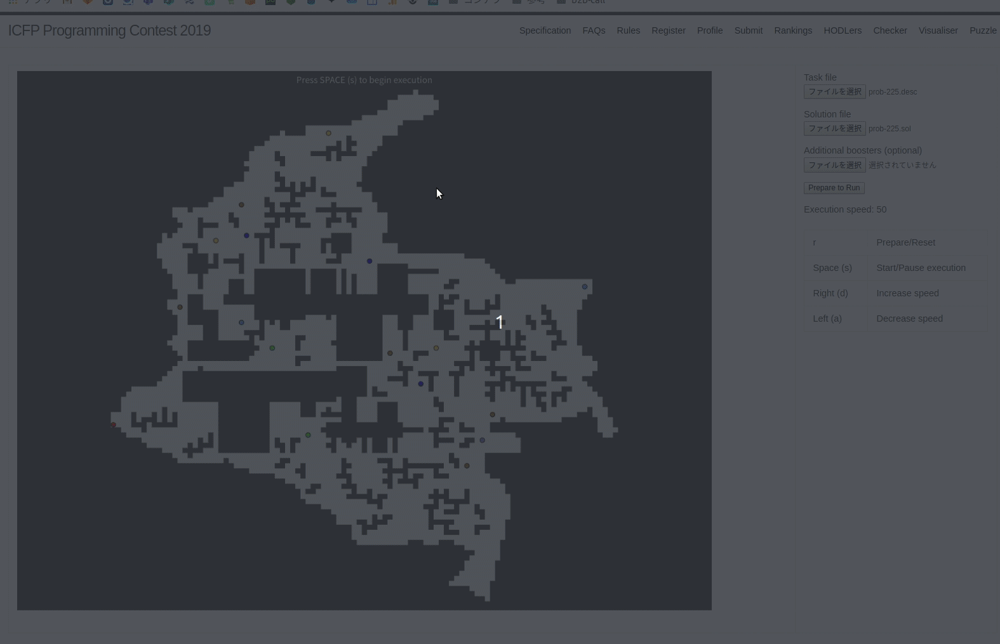
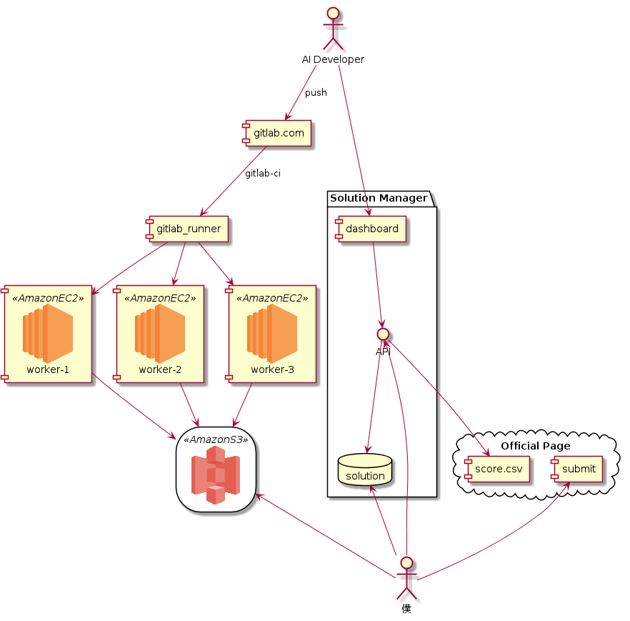
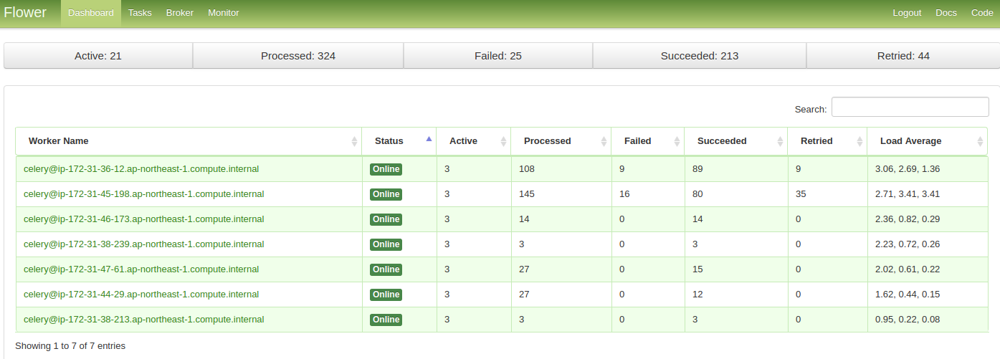
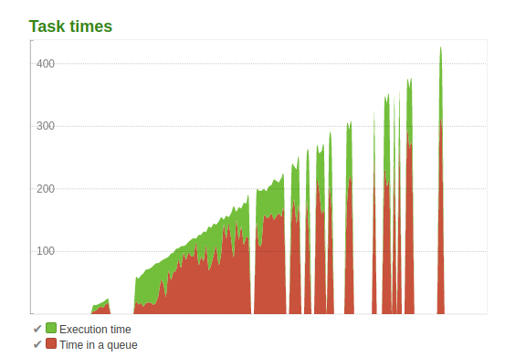
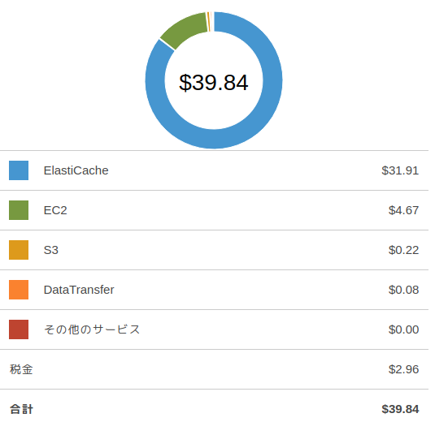
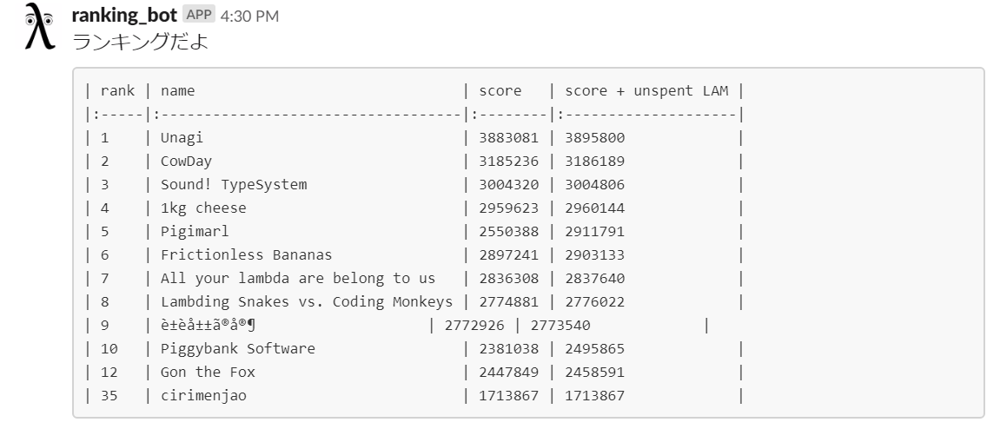
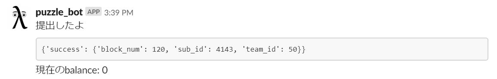
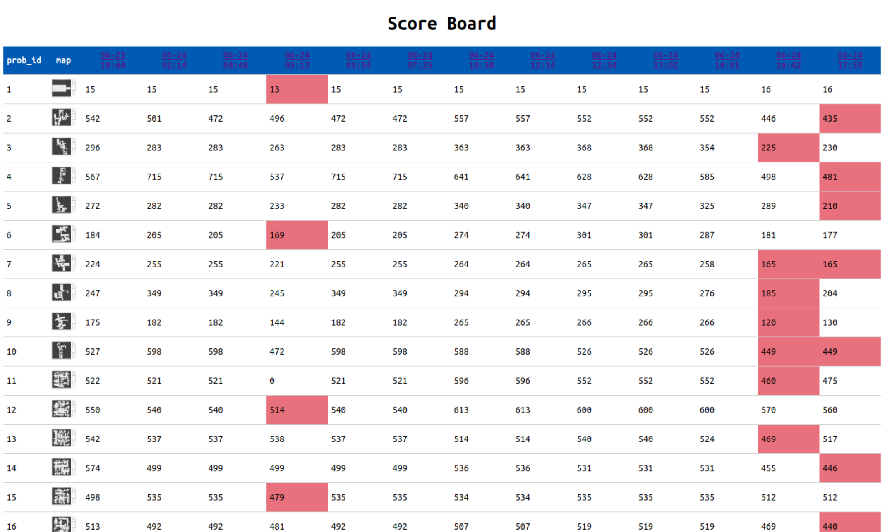
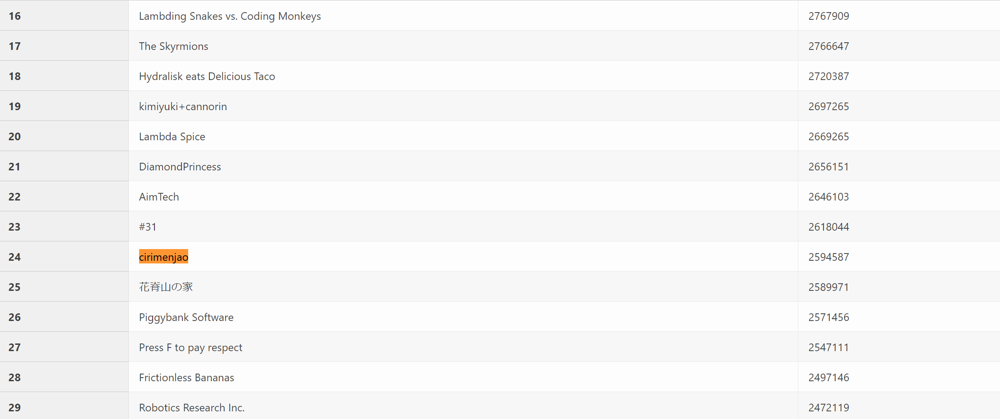
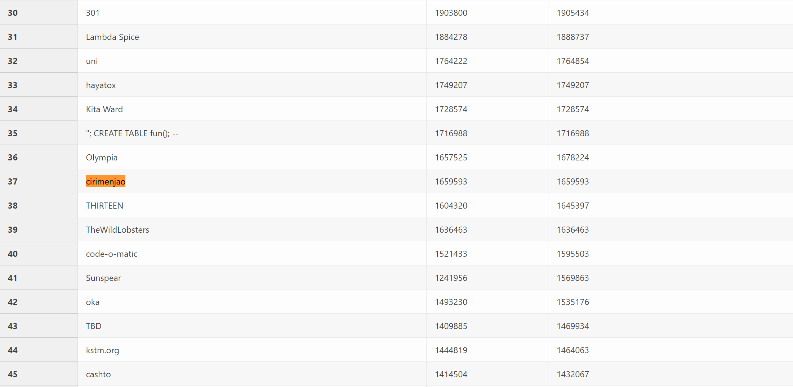

今年も [ICFP-PC](https://icfpcontest2019.github.io/) に会社のチームで参加したので、参加記を書きます。

## ICFP-PC とは

関数型プログラミング言語の国際学会 ICFP が主催する、チーム人数自由、言語も自由、な72時間耐久のプログラミングコンテストです。
僕は2017年の [punter](https://icfpcontest2017.github.io/) 、2018年の [nanobot](https://icfpcontest2018.github.io/) と参加して、今年が3回目になります。
今年は去年まで主戦力だったチームメイト2人が抜けてしまったため、去年までのチーム名である chirimenjako(ちりめんじゃこ) から h(飛車) と k(角) を抜いた cirimenjao(しりめんじゃお？) として参加しました。

## 今年の問題

二次元のマップ上を worker-wrapper というロボットが色を塗っていく、という問題でした。
マップ上にはブースターというアイテムが配置されており、それらを上手く使いこなして短時間で全域を塗りつぶすことが求められています。

ICFP-PC お馴染みの追加課題では、特定の条件に合うマップを作成するパズルと呼ばれる問題も出題されました。
僕は AI 部分にはあまり関わっていないので、詳細はチームメイトの記事に委ねます。

## 作ったもの

出来上がった AI を実行するインフラの作成、現在のランキングを通知する Slackbot の作成、今までのスコアの一覧を見れるようにするダッシュボードの作成、今までのベストスコアの解答を集めて提出するプログラムの作成、なんかをやってました。
色々作れて楽しかった～という感想ですが、割と去年と同じ感じのものを作っていたので、ちゃんと準備しておけばもっと色々やれたんじゃないか、という反省もあります。

### AI 実行環境

以下の様な構成で CI を構築しました。

流れとしては以下のようになっています。

1. AI 開発者が Gitlab に コードを push
2. gitlab-ci がそれを検知し gitlab-runner に投げる
3. gitlab-runner がコードを zip 化し、300問分のタスクをキューに投げる
4. 各ワーカがタスクを処理し結果を S3 に置く

キューイングの部分は昨年チームメイトが作ったのを真似して celery と subprocess で書きました。
工夫した点としては

* パイプラインの部分は別のメンバーが作ってくれていたので、 gitlab-runner からはスクリプトを一発実行するだけでタスクが飛ぶようにした
* celery は json エンコード可能な引数しか渡せない（頑張れば pickle とかも渡せる）のでプログラムは S3 に上げてワーカで落としてくるようにした
* 元々各タスク内でコンパイルしていたのをワーカ単位で最初の1回のみコンパイルするようにしたら飛躍的に速くなった

などです。
普段業務で使い慣れている ElastiCache の redis を celery のバックエンドに使ったら、 AWS の利用料金が $39 くらいになってビビりました（2日目途中くらいに気付いて EC2 に切り替えました）。
下記を参考にしました。

* [celery公式ドキュメント](http://docs.celeryproject.org/en/v4.3.0/index.html)
* [【Python】非同期タスクの実行環境+モニタリング環境を作る](https://qiita.com/xecus/items/9722b287cc6aee4083ae)
* [Pythonで非同期でタスクを実行して、モニタリングする環境をDockerで構築する](https://note.mu/shimakaze_soft/n/n4a2b63d320ed)

flower を入れると各ワーカでタスクが実行される様子が可視化できて楽しかったです。

ライトニング提出前に急ぎでワーカを足しまくったときは本番トラブル時さながらの高揚感がありました。
ワーカは最終的には18台ぐらいまで増えました（それでも AWS 利用料金の内訳はほぼ ElastiCache でした）。

### ranking_bot

ランキングはリアルタイムで更新されていたので、ランキングのページをスクレイピングして Slack に通知する bot を作りました。

上位10チームと cirimenjao と宿敵(？) Gon the Fox の順位を表示するようにしました。
最初は10～20位台だったこともあるのですが最終的には35位付近から中々這い上がれなくなりました。

### puzzle_bot

追加で出題されたパズルは新しい問題が15分に1回出され、毎回解答を出題しなければいけない形式だったため、出題ページを1秒に1回ポーリングして、出題されたらそれを解いて解答を提出し、結果を slack に通知する bot を作りました。

しかし、 cirimenjao は上位25チームに入ることはなく、最後までコインがもらえませんでした。。。
スタートダッシュが遅れたのと、ルールを勘違いしていたのが敗因でした。

### スコアボード

以下の様なスコアボードを作り、各タイミングでのスコアを一覧で見れるようにしました。

バックエンドはいつものように flask + sqlalchemy で作りました。
今年は提出したらスコアが公式ページに載るようになっていたので、一旦解答を提出し、スコアと S3 にある解答をマッピングするようなテーブルを作って管理していました。
マッピング処理は、日時を指定して（僕が）手動で API を叩くという若干温かみのある作業でやっていました。
スコアボードは各 AI がどういうケースで落ちるのか、どこが弱かったのか、などを見るのに大変参考になりました。

### 最良解の提出

最良解の提出は API からこれまでで最もスコアの高い解答を抽出し、 S3 から落としてきて zip でまとめて提出、という感じでやりました。
最終的には以下の様な割合になりました。

| 時刻 | 最良解に採用した件数 |
|:---|:---|
| 06-24 02:14 | 39 |
| 06-24 04:48 | 5 |
| 06-24 05:13| 119 |
| 06-24 05:54 | 6 |
| 06-24 07:25 | 6 |
| 06-24 12:34 | 4 |
| 06-24 13:02 | 28 |
| 06-24 14:01 | 15 |
| 06-24 16:42 | 49 |
| 06-24 17:58 | 29 |

## 結果

最終順位はライトニング24位、フルコンテスト37位でした。

* [ライトニング](https://icfpcontest2019.github.io/lightning-without-top-15.html)

* [フルコンテスト](https://icfpcontest2019.github.io/final-without-top-15.html)

主戦力を欠きながらも善戦したなーという想いもありつつ、昨年はフルコンテストで15位だったことを考えると、渋い結果と言えそうです。

## 感想

一昨年と昨年が結構違う問題だったので、今年も問題を見てから考えようと思っていたところが、蓋を開けてみたら昨年とだいたい同じ形式の問題だったので、これならもっと準備しておけば良かった…というのが反省点です。
とは言え昨年までは提出できていなかったライトニングに提出できたり、 AI の実行を CI でやれたり、スコアボードが活躍したり、などなどは昨年はできなかったことなので、成長は感じました。

## レポジトリ

https://gitlab.com/j_234ko/icfpc2019
