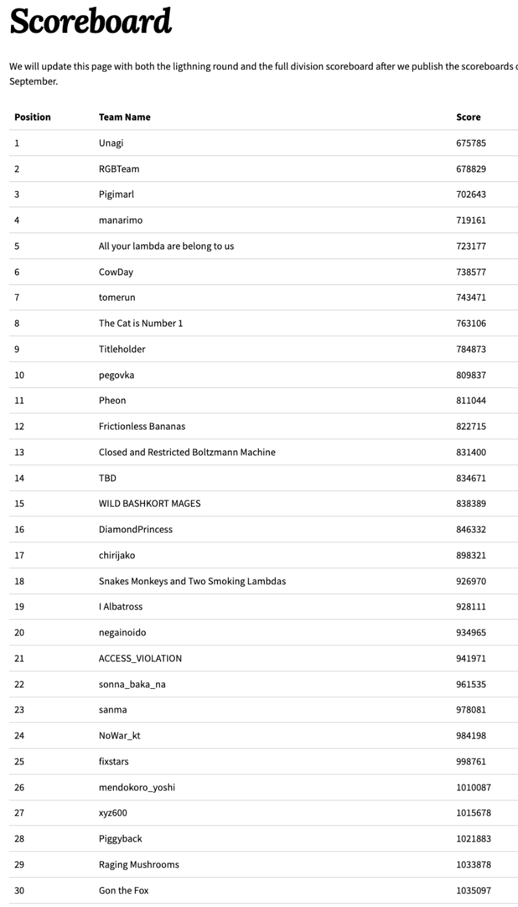
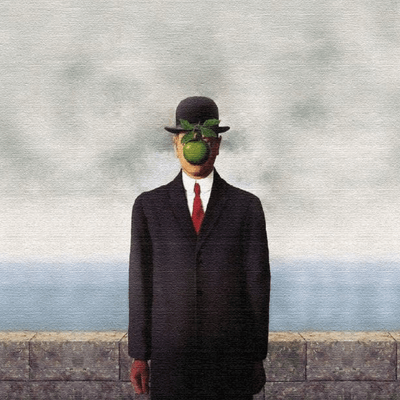
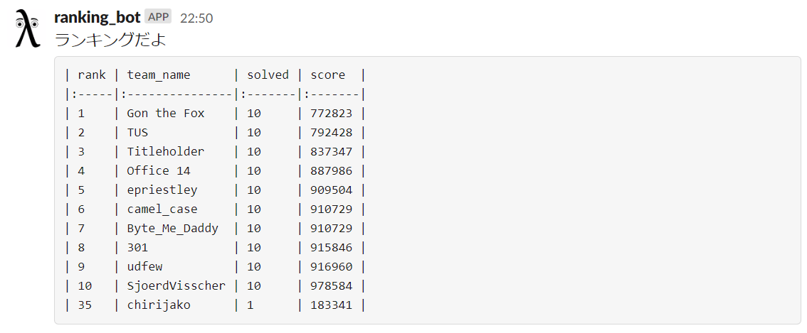
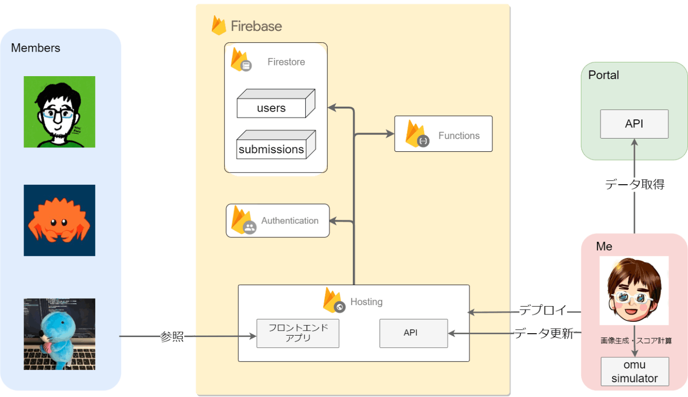

今年も [ICFP-PC](https://icfpcontest2022.github.io/) にチーム chirijako で参加しました。  
実は2017年から参加しているので、今年で6回目になります。  
毎年楽しく参加させていただいています。

## ICFP-PC とは

毎年開催されている72時間耐久のプログラミングコンテストです。

ICFP（国際関数型プログラミング学会）主催のコンテストですが、関数型言語に特化した問題が出るわけではなく、最近は割と普通のマラソンに近いです（過去にはラムダ計算を題材にした問題も出てましたが）。

一般的なコンテストと違うのは

* プログラムを提出するわけではなく解を提出する → マシンリソースを自分で調達すれば計算時間にとらわれない、利用できる言語も自由
* チーム人数が無制限 → 色んな役割の人をチームに入れられる

の2点で、これによって何でもアリの楽しいコンテストになってます。

## 結果

17位でした。

前年の6位には及びませんでしたが、終了2時間前までは30位付近を彷徨っていたので、そう考えると良い成績なんじゃないかなと思います。

## チームメンバー

* [daiju](https://twitter.com/WniKwo)：インフラ + ソルバー（ Rust ）
* [omu](https://twitter.com/omurice__)：ビジュアライザ（ Rust ）
* [sntea](https://twitter.com/hogex100)：ソルバー（ Rust ）
* [僕](https://twitter.com/akagenorobin)：ダッシュボード（ Typescript, Python ）

競プロガチ勢 の [iwashi](https://twitter.com/iwashi31) や [nola_suz](https://twitter.com/nola_suz) が抜けてソルバー書く人が不足してるんですが、助っ人として現れた sntea くんがつよつよで助かりました。

## 今年の問題

400x400 のエリアを分割 + 色塗りをしていって、目標の画像に近付けるという問題でした。

| problem | solution |
|---|---|
|||

ただし分割や色塗りのコストがエリアが小さくなるほど高くなるような関数になっていて、如何に広いエリアを保ちつつ色を塗るかがポイントになる問題でした。

## やったこと

### 事前準備

今年は Firebase 使おう！と決めていたので、アカウントの準備と、 `Hosting` `Firestore` `Functions` `Authentication` の素振りをしていました。

### 9/2(金)

* 問題読みつつ公式のシミュレータを使って手動解を書いたりするが辛くなってやめる
* 例年通り公式のスコアボードをハックしてランキングbotを作る

* 夜はしっかり寝る

### 9/3(土)

* 昼くらいにはダッシュボードにスコアが出るようになる
* omu シミュレータが動くようになっていたので画像を吐き出して imagemagick で gif にしてダッシュボードに組み込む
* sntea のグリーディー解と daiju の焼きなまし解でスコアを伸ばしていく
* submission をひたすらダッシュボードに反映する人間 CI と化す
* この日も夜はしっかり寝る

### 9/4(日)

* 継続的に人間 CI をやる
* ダッシュボードのコードを整えたり提出解を眺めたりする
* 色塗りが幾何平均になってコストが最適化されたり、 daiju がチェスボードを手動で解いたりする
* 公式のスコアボードにはチームごとの合計点しか出ていないが、APIでは問題ごとにスコアが返って来ていることに気付き、スコアボードを作る
* スコアボードを見た omu が今の方針じゃまずそうと気付き、大きなエリアで cut して color して merge みたいな手順が良さそう、と思い付く（ omu メソッドと呼ばれる）
* gitlab がタイミング悪くメンテナンスタイムに入ったりする
* この日も夜はしっかり寝る

### 9/5(月)

* 継続的に人間 CI をやる
* image と move のコストを分けて見たいという話になり、 omu シミュレータが吐き出したそれぞれのコストをダッシュボードに反映するようにする
* omu シミュレータを直すのに Rust を書くのに手こずったりする
* omu ビジュアライザ + omu メソッドで手動解を作る
* omu ビジュアライザで格子をマージする最適コストを探す
* 格子が切られている問題で格子をマージ + 前半の問題の解で解を作るスクリプトを書く
* 手動解で地道にスコアを上げていく
  * 力作の手動解
  
* daiju が omu メソッド + 探索のソルバーを書いたがスコア上がらず
* スコアボード凍結後に sntea の omu メソッド + DP のソルバーができあがりスコアが大幅に改善される

## 作ったもの

### レポジトリ

https://gitlab.com/icfp-pc2022_chirijako/icfp-pc2022

### ダッシュボード

https://chirijako-2022.web.app/
~~そのうち閉鎖します。~~
閉鎖しました。

### アーキテクチャ

### 説明

* 昨年からですがフロントは Typescript + React で実装しました
* バックエンドは今年始めて Firebase を使いました
* 画像（ gif 含む）はビルド成果物に含めてました
* なのでダッシュボード更新のたびに omu simulator で画像を吐き出して gif 作成 + ビルドしてデプロイ、をやってました
* スコアは公式のAPIを叩いて取ってきたデータを json に保存 + Functions で立てたAPIにPOSTして反映、をしていました
* 途中から公式で取ってきたデータを omu simulator で加工してPOST、になりました
* アカウントと submission を紐付けてメンバーごとのスコアボードみたいな感じにしたかったんですが、ちょっと叶いませんでした（提出解の1行目にソルバーの名前入れるか、みたいな案はあったんですが結局導入せず）

## 感想

（例年通り）

* チームメンバーが強かった
* チーム戦は楽しい
