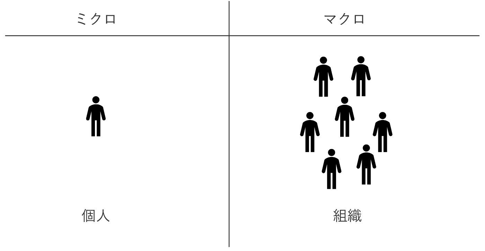
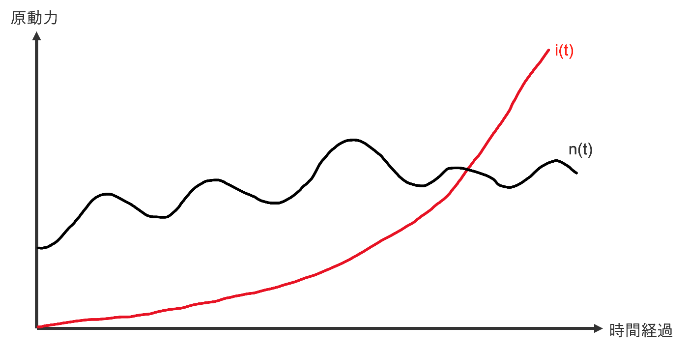
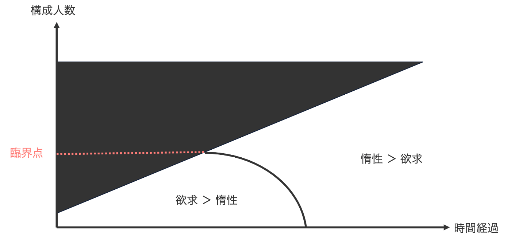
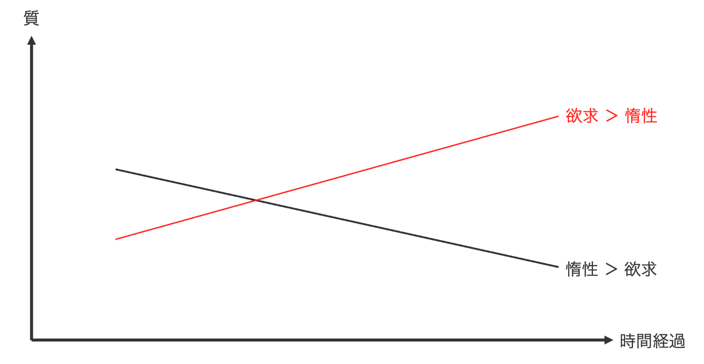

新人研修で「エセ組織論モデル」なるものを紹介したので、ここに供養します。

## 組織とは

組織とは「ある共通の目的を持った個人の集まり」の意味です。  
つまり個人を構成要素（ミクロ）とした系（マクロ）が組織と捉えて良いでしょう。

## 個人の原動力をモデル化する

個人の原動力とはなんでしょう？  
考えやすいように「ある共通の目的」は何らかの社会的な目的としておきましょう。

社会的な目的を達成するための原動力は **欲求** (needs) です。  
これは適当にマズローの欲求階層説に基づいていることにしときましょう。  
人によって欲求は様々（人の役に立ちたい・有名になりたい・お金が欲しい）なので、多次元量でしょう。  
また、欲求は時間変化するはず、ということで、時間 t の関数として

$$\vec{n}(t)$$

と定義しましょう。

目的を果たすための何らかの活動を始めた場合、大きな原動力になるものがもう1つあります。  
それが **惰性** (inertia) です。  
惰性は一度動き出したものが動き続けるという力で、時間が経てば経つほどその力は強くなります。

欲求の絶対値 n(t) と惰性 i(t) を図示すると以下の様なイメージです。

原動力 (driver) は

$$D_{個人}(t) = n(t) + i(t)$$

になります。

## 組織の原動力をモデル化する

組織が単なる個人の集まりで、個人間の相互作用とか、マネージャーが統制をとるとか、そういうことはない状況を考えましょう。

欲求は組織を構成する個人のベクトルが揃っていれば原動力はその分大きくなるでしょうし、バラバラだったら原動力は小さくなりそうです。  
惰性は構成人数に比例して大きくなる気がします（？）。  
以上から

$$D_{組織}(t) = \| \sum \vec{n}(t) \| + \sum i(t)$$

です。

## 相図を書いてみる

上記のようにモデル化すると、欲求は統計力学で言うところのエネルギーで、惰性はエントロピーのような気分になります。  
そうすると横軸を時間経過、縦軸を組織の構成人数として相図を書きたくなりますね。

組織の構成人数が多くなるとベクトルのゆらぎは大きくなりそうなので、原動力の欲求成分は相対的に小さくなりそうです。   
そうすると「欲求 ＞ 惰性」相と「惰性 ＞ 欲求」相の境目は以下の様なイメージになります。

しれっと新しい概念を導入して、時間経過に対して増える構成人数は上限があるだろうということで、存在しない領域を黒塗りしました。

## 惰性が欲求を上回るとどうなる？

僕の経験に基づくと、欲求が原動力になっている組織は成長していけますが、惰性が原動力になっている組織は劣化していきます。

ここで「惰性 ＞ 欲求」の状態を脱するにはエンジニアリングマネージャーが必要なのだ！という話に繋がっていきます。

## おわりに

このモデルの着想は

* 組織や個人の原動力って欲求と惰性に分けられるよね
* 欲求って統計力学で言うところのエネルギーで、惰性ってエントロピーみたいなもんだよね

ってことだったんですが、相互作用を入れてないので、統計力学にはなってないし、特に何の面白味もないモデルになってしまいました。

まあこれはこれで伝えたいことは伝えられたかなと思っているので、良しとしましょう。
