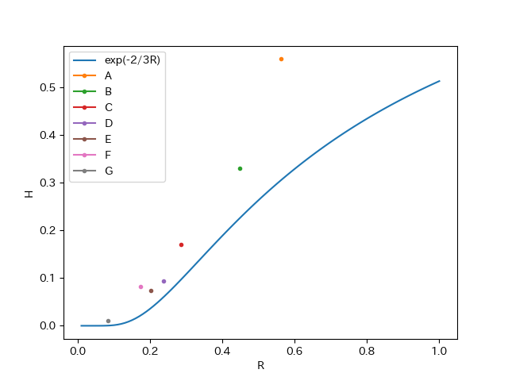

## 問題設定

あるサービスの月間のユーザ数(= MAU)を N 、1日のユーザ数(= DAU)を M とする。
このサービスを月間20日以上利用しているユーザ数（= ヘビーユーザ数）は？

という問題を考察したのでメモ。

## 考察

MAU に含まれるユーザで1ヶ月（30日としておく）のうち x 日利用する人の割合を P(x) とおく。
求めたいのは

$$\sum_{x=20}^{30} NP(x)$$

である。DAU に含まれるユーザで1ヶ月のうち x 日利用する人の数は

$$NP(x) \times \frac{x}{30}$$

よって DAU は

$$M = \sum_{x=1}^{30} NP(x) \times \frac{x}{30}$$

と表せて、ここから1ユーザあたりの利用日数の期待値が

$$E[x] = \sum_{x=1}^{30} xP(x) = 30\frac{M}{N} = 30R$$

となることがわかる（ただし R = M/N とおいた）。
これ割と非自明な結果だと思ったんですが自明ですかね🤔
（例えば DAU と MAU の比率が 1:4 だったら1ユーザが1ヶ月に利用する期間の期待値が1週間ということ）

というわけで、 DAU と MAU の値からは分布の期待値しか決まらないことがわかったので、ヘビーユーザの数を推定するには分布を仮定する必要がある。
簡単のために[指数分布](https://ja.wikipedia.org/wiki/%E6%8C%87%E6%95%B0%E5%88%86%E5%B8%83)

$$P(x)=\lambda e^{-\lambda x}$$

を仮定しよう。指数分布の期待値は

$$E[x]=\frac{1}{\lambda}$$

だから

$$\lambda = \frac{1}{30R}$$

となる。20日以上利用しているユーザ数は

$$\sum_{x=20}^{30} NP(x) \sim \int_{20}^{\infty} NP(x) dx = \int_{20}^{\infty} N \lambda e^{- \lambda x} dx = N \bigl[ -e^{-\frac{x}{30R}} \bigr]_{20}^{\infty} = Ne^{-\frac{2}{3R}}$$

と求まる。

## 検証

さて、いい生活のサービス A〜G で過去30日の R (= DAU / MAU) と H (= ヘビーユーザ数 / MAU) を実際に見てみると、以下の様になった。

| サービス | R | H |
| --- | --- | --- |
| A | 0.5615171138 | 0.559666975 |
| B | 0.4487651549 | 0.3297709924 |
| C | 0.284519828 | 0.1698518872 |
| D | 0.2378303199 | 0.09469170144 |
| E | 0.2018749334 | 0.07414509428 |
| F | 0.1734296832 | 0.08282379099 |
| G | 0.08352623457 | 0.01080246914 |

ログイン日数を指数分布で仮定した場合は

$$H = e^{-\frac{2}{3R}}$$

なのでそれと重ねてプロットすると以下の様になる。

そもそも MAU に占めるヘビーユーザの割合が高い場合は指数分布の仮定が適切ではないので、 H が大きいところでは大きくずれ、小さいところは比較的近くなっている様子が伺える。

これを見るとサービス F は R の割には H が大きい、と言えそう？

実際ログイン日数の分布を見ても H が小さい E や G は指数分布に近く、 A や B は程遠そうな雰囲気があった。

そもそも指数分布はポアソン過程（あるイベントが一定確率で発生する）から導かれる分布だから、指数分布に近いということは「何かそれが必要なイベントが一定確率で発生して利用する」サービスだということになる。サービス E や G は確かにそういう性質のサービスだなあという感想だし、 F はちょっと系統が違うサービスではあるので、直感とは一致した結果。
